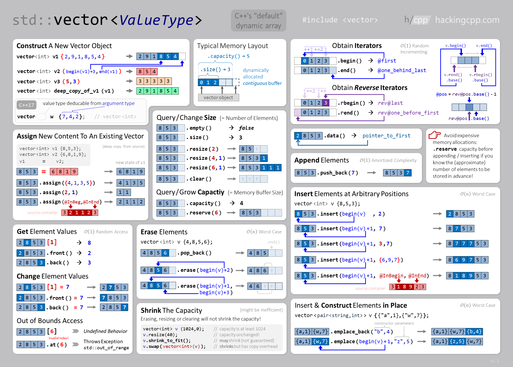

# **Vector** is a class that creates a dynamic array allowing insertions and deletions at the back.

### First import Vector Library
```cpp
#include <vector>
```

### Syntax 
  - #### 1d Vector
    ```cpp
    // vector <DataType> VectorName(VectorSize);
    vector <int> v(6);
    v = {7,1,9,5,2,4};
    ```
  - ### 2d Vector
    ```cpp
    vector <vector <int>> vec;
    vec = { {1, 2, 3},{4, 5, 6},{7, 8, 9} };
    ```
  
### Vector Functions :
| Function Name | Time Complexity | what does it do?! |
|--------------|:-----------------:|----------------------|
|[begin()](https://www.geeksforgeeks.org/vectorbegin-vectorend-c-stl/) | `O(1)` | Returns an iterator to the first element in the vector |
|[end()](https://www.geeksforgeeks.org/vectorbegin-vectorend-c-stl/) | `O(1)` | Returns an iterator to the last element in the vector |
|[size()](https://cplusplus.com/reference/vector/vector/size/) | `O(1)` | Returns the number of elements in the vector |
|[max_size()](https://www.geeksforgeeks.org/vector-max_size-function-in-c-stl/) | `O(1)` |  Returns the maximum number of elements that can hold |
|[empty()](https://cplusplus.com/reference/vector/vector/empty/) | `O(1)` | Return 1 if vector is empty else return 0 |
|[at()](https://www.javatpoint.com/cpp-vector-at-function) | `O(1)` | Access element |
|[front()](https://www.javatpoint.com/cpp-vector-front-function) | `O(1)` |  Access first element |
|[back()](https://www.javatpoint.com/cpp-vector-back-function)  | `O(1)` | Access last element |
|[assign()](https://www.geeksforgeeks.org/vector-assign-in-c-stl/) | `O(n)` |  Assign vector content | 
|[push_back()](https://cplusplus.com/reference/vector/vector/push_back/) | `O(1)` |  Add element at the end |
|[pop_back()](https://www.javatpoint.com/cpp-vector-pop-back-function) | `O(1)` |  Delete last element |
|[insert()](https://www.javatpoint.com/cpp-vector-insert-function) | `O(n)` | Insert elements |
|[erase()](https://cplusplus.com/reference/vector/vector/erase/) | `O(n)` | Erase elements |
|[swap()](https://www.geeksforgeeks.org/vectorat-vectorswap-c-stl/) | `O(1)` |  Swap content |
|[clear()](https://www.geeksforgeeks.org/vector-erase-and-clear-in-cpp/) | `O(n)` | Clear content |
|[emplase()](https://cplusplus.com/reference/vector/vector/emplace/) | `O(n)` |  Construct and insert element |

### Initialize a vector
  ```cpp
  vector <int> v;
  v.push_back(5);
  v.push_back(3);
  v.push_back(2);
  v.push_back(7);
  v.push_back(1);
  // or
  vector <int> v1(5);
  for(int i = 0; i < 5; i++)
      cin >> v1[i];
  // or
  int a;
  vector <int> v2;
  for(int i = 0; i < 5; i++){
      cin >> a;
      v2.push_back(a);
  }
  // or
  int b;
  vector <int> v3;
  while(cin >> b)
     v3.push_back(b);
  ```
### Print elements of Vector
  - #### 1d Vector
    ```cpp
    vector <int> v4 = { 10, 20, 30, 40, 50, 60 };
    for(int i = 0; i < 5; i++)
        cout << v4[i] << ' ';
    // or
    for(auto element : v4)
        cout << element << ' '; 
    ```
    output : 
    ```
    10 20 30 40 50 60 
    10 20 30 40 50 60 
    ```
  - #### 2d Vector
    ```cpp
    vector <vector<int>> v { {1, 2},{4, 5, 6},{7, 8, 9, 10} };
    for(int i = 0; i < v.size(); i++) {
      for(int j = 0; j < v[i].size(); j++)
        cout << v[i][j] << " ";
      cout << endl;
    }
     ```
    output : 
    ```
    1 2
    4 5 6
    7 8 9 10
    ```
### Vector uses :
  - #### Swap two vector
    ```cpp
    vector <int> v1(4,3), v2(7,2); /// v1 = {3,3,3,3}
                                   /// v2 = {2,2,2,2,2,2,2}
    swap(v1,v2);
    cout << "vector 1 : ";
    for(int i = 0; i < v1.size(); i++)
        cout << v1[i] << ' ';
    cout << "vector 2 : ";
    for(int i = 0; i < v2.size(); i++)
        cout << v2[i] << ' ';
    ```
    output : 
    ```
    vector 1 : 2 2 2 2 2 2 2
    vector 2 : 3 3 3 3
    ```
  - #### Sort
    ```cpp
    vector <int> v{1, 5, 8, 9, 6, 7, 3, 0};
    sort(v.begin(),v.end());
    for(auto element : v)
        cout << element << ' ';
    ```
    output : 
    ```
    0 1 3 5 6 7 8 9
    ```    
  - #### Reverse
    ```cpp
    reverse(v.begin(), v.end());
    for(auto element : v)
        cout << element << ' ';
    ```
    output : 
    ```
    9 8 7 6 5 3 1 0
    ```
  - #### Max & Min element
    ```cpp
    cout << *min_element(v.begin(),v.end());
    cout << *max_element(v.begin(),v.end()); 
    ```
    output : 
    ```
    1
    9
    ```

### Use for
  - Simple storage
  - Adding but not deleting
  - Serialization
  - Quick lookups by index
  - Easy conversion to C-style arrays
  - Efficient traversal (contiguous CPU caching)

### Do not use for
  - Insertion/deletion in the middle of the list
  - Dynamically changing storage
  - Non-integer indexing

### Cheat Sheet


