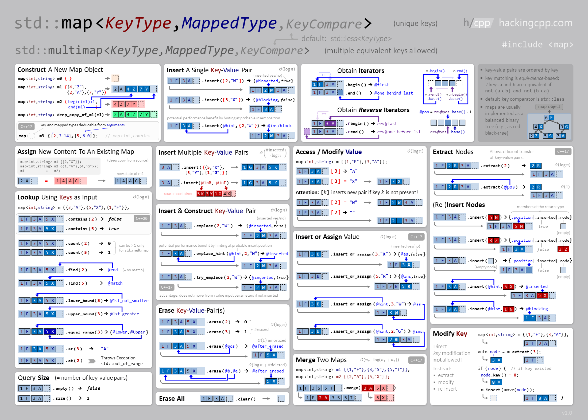

# **Map** is an associate container for storing unique key-value pairs, each key is associated with only one value(one to one mapping).

### First include Map Library
```cpp
#include <map>
```

### Syntax 
  ```cpp
  // map <KeyType,ValueType> mapName;
  map <int, string> m;
  ```
  
### Map Functions
| Function Name | Time Complexity | what does it do?! |
|--------------|:-----------------:|----------------------|
|[begin()](https://www.javatpoint.com/post/cpp-map-begin-function) | `O(1)` | Returns an iterator to the first element of the map|
|[end()](https://www.javatpoint.com/post/cpp-map-end-function) | `O(1)` | Return an iterator which is next to the last entry in the map|
|[size()](https://www.javatpoint.com/post/cpp-map-size-function) | `O(1)` | Returns the number of elements in the map|
|[max_size()](https://www.geeksforgeeks.org/map-max_size-in-c-stl/) | `O(1)` | Returns the maximum number of elements that the map can hold|
|[empty()](https://www.geeksforgeeks.org/mapempty-c-stl/) | `O(1)` | Returns 1 if map is empty|
|[at()](https://www.javatpoint.com/post/cpp-map-at-function) | `O(log(n))` | Retrieve the element with given key|
|[insert()](https://www.javatpoint.com/post/cpp-map-insert-function) | `O(log(n))` | Insert element|
|[erase()](https://www.geeksforgeeks.org/map-erase-function-in-c-stl/) | `O(log(n))` | Erase element|
|[swap()](https://www.javatpoint.com/post/cpp-map-swap-function) | `O(1)` | Swap content|
|[clear()](https://www.geeksforgeeks.org/mapclear-c-stl/) | `O(n)` | Delete all the elements of the map|
|[emplase()](https://www.javatpoint.com/post/cpp-map-emplace-function) | `O(log(n))` | Construct and insert the new elements into the map  |
|[find()](https://www.geeksforgeeks.org/map-find-function-in-c-stl/) | `O(log(n))` | Search for an element with given Key|
|[count()](https://www.geeksforgeeks.org/map-count-function-in-c-stl/) | `O(log(n))` | Returns 1 if the element with given Key is present in the map|

### Initialize map
  ```cpp
  map <int, string> m1 = {{503, "mazen"}, {501, "ali"}, {502, "ahmed"}};
  // or
  map <int, string> m2;
  m2[2] = "khaled";
  m2[1] = "ashraf";
  m2[3] = "siiiii";
  // or
  string s;
  map <int, string> m3;
  for(int i = 0; i < 5; i++){
      cin>>s;
      m3[i]=s;
  }
  // or
  int x, size = 5; string s;
  map <int, string> m4;
  while(size--){
    cin >> x >> s;
    m4[x] = s;
  }
  // or
  map <char, int> m5 = {{'a', 10}, {'c', 20}, {'b', 30}};
  m5.insert(pair <char, int> ('s', 40));
  m5.insert({'n', 11});
  ```
### Print elements of map
  - Print value only
    ```cpp
    char arr[5] = {'v', 's', 'r', 's', 'a'};
    map <int, string> m;
    for(int i = 0; i < 5; i++)
        m[i] = arr[i];
    for(int i = 0; i < 5; i++)
        cout << m[i] <<endl;
    ```
    output : 
    ```
    v
    s
    r
    s
    a
    ```
  - Print Keys & Values
    ```cpp
    map <char, int> m = {{'a', 10}, {'c', 20}, {'b', 30}};
    for(auto x: m)
        cout << x.first << " -> " << x.second <<endl;
    ```
    output :
    ```
    a -> 10
    b -> 30
    c -> 20
    ```
### Map uses :
  - #### Frequency
    ```cpp
    vector <int> vec = { 1, 2, 9, 0, 1, 4, 4, 5 };
    map <int, int> freq;

    for (int i = 0; i < vec.size(); i++)
            freq[vec[i]]++;

    for(auto x: freq)
        cout << x.first << " -> " << x.second << endl;
    ```
    output : 
    ```
    0 -> 1
    1 -> 2
    2 -> 1
    4 -> 2
    5 -> 1
    9 -> 1
    ```
### Properties :
  - **Storing order** The map stores the elements in ascending order by $keys$
  - All the elements in a map have **unique keys**
  - Insertion of Elements $O(log N)$
  - Deletion of Elements $O(log N)$
----
### Related Articles :
  - [Multimap](https://www.geeksforgeeks.org/multimap-associative-containers-the-c-standard-template-library-stl/?ref=rp)
  - [Unorder_map](https://en.cppreference.com/w/cpp/container/unordered_map)

### Cheat Sheet

