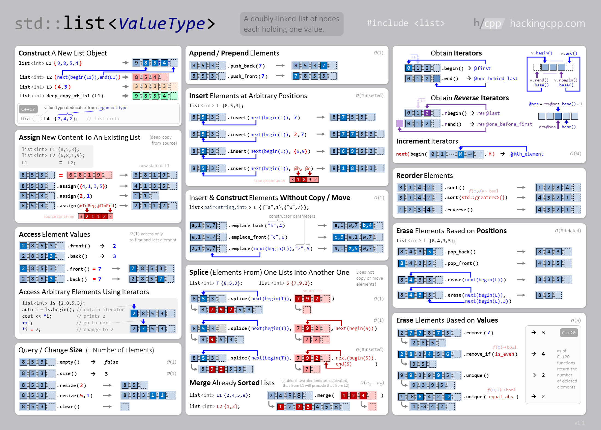

# **List** is a container that supports constant time insertion and removal of elements from anywhere in the container

### First import Set Library
```cpp
#include <list>
```

### Syntax 
  ```cpp
  // list <DataType> listName(listSize);
  list <int> l(4);
  ```
  
### List Functions :
 | Function Name | Time Complexity | what does it do?! |
|--------------|:-----------------:|----------------------|
|[begin()](https://en.cppreference.com/w/cpp/container/list/begin) | `O(1)` | Returns an iterator to the beginning |
|[end()](https://en.cppreference.com/w/cpp/container/list/end) | `O(1)` | Returns an iterator to the end |
|[size()](https://www.javatpoint.com/post/cpp-list-max_size-function) | `O(1)` | Returns the number of elements |
|[max_size()](https://www.geeksforgeeks.org/list-max_size-function-in-c-stl/) | `O(1)` | Returns the maximum possible number of elements that the list can hold |
|[empty()](https://www.javatpoint.com/post/cpp-list-empty-function) | `O(1)` | Return 1 if list is empty else return 0 |
|[insert()](https://en.cppreference.com/w/cpp/container/list/insert) | `O(n)` | Insert elements |
|[emplase()](https://www.geeksforgeeks.org/list-emplace-function-in-c-stl/) | `O(1)` | Construct and insert element |
|[push_back()](https://www.geeksforgeeks.org/list-push_back-function-in-c-stl/) | `O(1)` | Add a new element at the end |
|[pop_back()](https://www.geeksforgeeks.org/list-pop_back-function-in-c-stl/) | `O(1)` | Delete the last element |
|[push_front()](https://www.geeksforgeeks.org/list-push_front-function-in-c-stl/) | `O(1)` | Add a new element to the front |
|[pop_front()](https://www.geeksforgeeks.org/list-pop_front-function-in-c-stl/) | `O(1)` | Delete the first element |
|[resize()](https://www.javatpoint.com/post/cpp-list-resize-function) | `O(n)` | It changes the size of the list |
|[swap()](https://www.geeksforgeeks.org/listswap-c-stl/) | `O(1)` | Swap contents |
|[erase()](https://en.cppreference.com/w/cpp/container/list/erase) | `O(n)` | Erase single element by given iterator |
|[remove()](https://www.geeksforgeeks.org/list-remove-function-in-c-stl/) | `O(n)` | Removes all the elements from the list, which are equal to given element |
|[clear()](https://www.geeksforgeeks.org/listclear-c-stl/) | `O(n)` | Clears the contents |

### Initialize a List
  ```cpp
  list <int> l1 = {1, 2, 3, 4, 5, 6, 7, 8, 9};
  // or
  list <int> l2(4);
  l.push_back(4);
  l.push_front(1);
  // or
  list <int> l3;
  l3.assign({5, 4, 8, 7});
  // or
  int a;
  list <int> l4;;
  for(int i = 0; i < 5; i++){
      cin >> a;
      l4.push_back(a);
  }
  ```
### Print elements of List
  ```cpp
  list <int> l = {4, 5, 8, 6, 3, 1};
  for(auto element : l)
      cout << element << ' ';
  // or
  for(auto it = l.begin(); it != l.end(); it++)
        cout << *it << ' ';
  ```
  output : 
  ```
  4 5 8 6 3 1
  4 5 8 6 3 1
  ```
### List uses :
  - #### Merging (Sorted)
    ```cpp
    list <int> l1 = {0, 2, 4}, l2 = {1, 3, 5};
    l1.merge(l2);
    for(auto element : l1)
        cout << element << ' ';
    ```
    output : 
    ```
    0 1 2 3 4 5
    ```
  - #### Merging two lists as they are
    ```cpp
    list <int> l3 = {0, 2, 4}, l4 = {1, 3, 5};
    l3.splice(l3.begin(), l4);
    for(auto element : l3)
        cout << element << ' ';

    list <int> l5 = {0, 2, 4}, l6 = {1, 3, 5};
    l5.splice(l5.end(), l6);
    for(auto element : l5)
        cout << element << ' ';
    ```
    output : 
    ```
    1 3 5 0 2 4
    0 2 4 1 3 5
    ```
    
### Use for
  - Insertion into the middle/beginning of the list
  - Efficient sorting (pointer swap vs. copying)

### Do not use for
  - Direct access

----
### Related Articles :
  - ### [forward_list](https://cplusplus.com/reference/forward_list/forward_list/)

### Cheat Sheet

