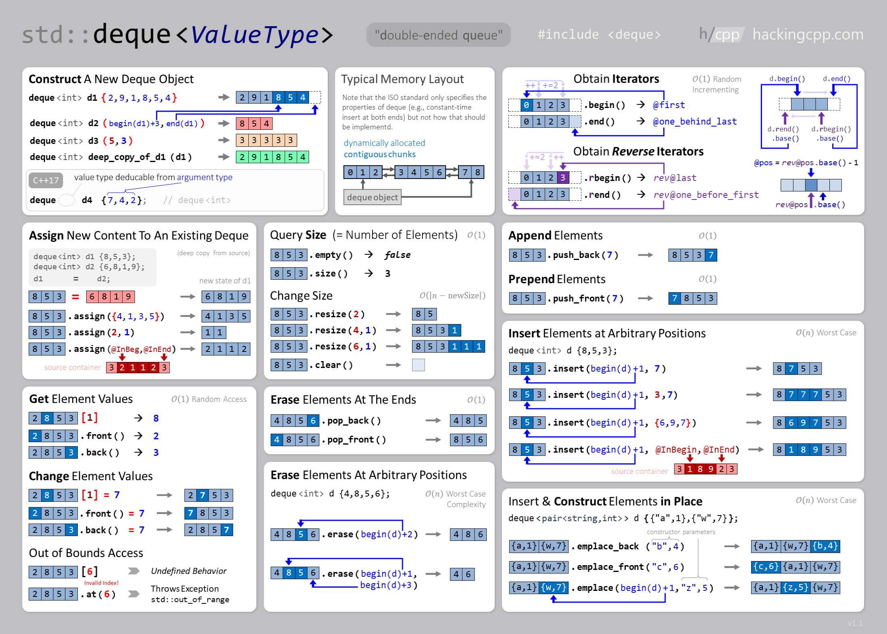

# **Deque (Deck)** is an indexed sequence container that allows fast insertion and deletion at both its beginning and its end.

### First import Deque Library
```cpp
#include <deque>
```

### Syntax 
```cpp
// deque <DataType> dequeName;
deque <int> d = {1,2,3,4,5};
```
  
### Deque Functions :
| Function Name | Time Complexity | what does it do?! |
|--------------|:-----------------:|----------------------|
|[begin()](https://www.javatpoint.com/post/cpp-deque-begin-function) | `O(1)` | Returns an iterator to the first element|
|[end()](https://www.javatpoint.com/post/cpp-deque-end-function) | `O(1)` | Returns an iterator to the last element|
|[size()](https://cplusplus.com/reference/deque/deque/size/) | `O(1)` | Returns the number of elements|
|[max_size()](https://www.geeksforgeeks.org/deque-max_size-function-in-c-stl/) | `O(1)` | Returns the maximum number of elements that the deque can hold|
|[resize()](https://cplusplus.com/reference/deque/deque/resize/) | `O(n)` | Change size|
|[empty()](https://cplusplus.com/reference/deque/deque/empty/) | `O(1)` | Return 1 if vector is empty else return 0|
|[at()](https://www.javatpoint.com/post/cpp-deque-at-function) | `O(1)` | Access element|
|[front()](https://en.cppreference.com/w/cpp/container/deque/front) | `O(1)` | Access first element|
|[back()](https://www.javatpoint.com/post/cpp-deque-back-function) | `O(1)` | Access last element|
|[assign()](https://www.javatpoint.com/post/cpp-deque-assign-function) | `O(n)` | Assign deque content|
|[push_back()](https://cplusplus.com/reference/deque/deque/push_back/) | `O(1)` | Add element at the end|
|[pop_back()](https://www.geeksforgeeks.org/dequepop_front-dequepop_back-c-stl/) | `O(1)` | Delete last element|
|[push_front()](https://www.javatpoint.com/post/cpp-deque-push_front-function) | `O(1)` | Add element at the end|
|[pop_front()](https://cplusplus.com/reference/deque/deque/pop_front/) | `O(1)` | Delete last element|
[insert()](https://cplusplus.com/reference/deque/deque/insert/) | `O(n)` | Insert elements|
|[erase()](https://www.javatpoint.com/post/cpp-deque-erase-function) | `O(n)` | Erase elements|
|[swap()](https://www.javatpoint.com/post/cpp-deque-swap-function) | `O(1)` | Swap content|
|[clear()](https://www.geeksforgeeks.org/dequeclear-dequeerase-c-stl/) | `O(n)` | Clear content|
|[emplase()](https://www.javatpoint.com/post/cpp-deque-emplace-function) | `O()` | Construct and insert element |

### Initialize a Deque
  ```cpp
  deque <int> d1 = {1,2,3,4,5};
  d1.push_back(6); 
  d1.push_front(0); 
  // or
  int a;
  deque <int> d2;
  for(int i = 0; i < 5; i++){
      cin >> a;
      d2.push_back(a);
  }
  // or
  int b;
  deque <int> d3;
  while(cin >> b)
      d3.push_back(b);
  ```
### Print elements of Deque
  ```cpp
  deque <int> d = {1,2,3,4,5};
  for(auto t = d.begin(); t != d.end(); t++)
      cout << *t << ' '; 
  // or
  for(auto element : d)
      cout << element << ' '; 
  ```
  output : 
  ```
  1 2 3 4 5
  1 2 3 4 5
  ```
### Properties :
  - Accessing Elements $O(1)$
  - Insertion or removal of elements $O(N)$
  - Insertion or removal of elements at start or end $O(1)$

### Cheat Sheet

